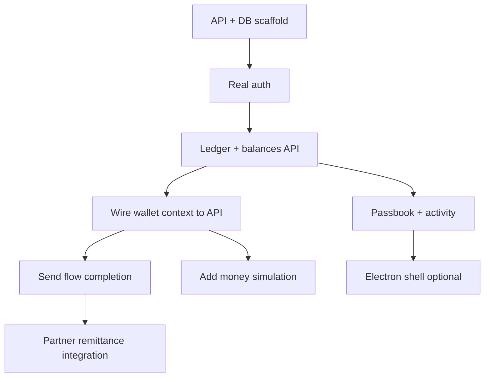

# Roadmap & Future Improvements

This document captures known gaps, suggested next steps, and technical decisions to make when evolving the prototype into a production app.

---

## Priority 1 — Core platform

### 1. Backend API layer

**Why:** All banking logic is client-side mock data. Balances can be edited in DevTools; send confirmations do nothing.

**Suggested approach:**

```
apps/
├── web/          # Next.js frontend (keep)
└── api/          # New: Hono/Fastify/Express or Next Route Handlers
```

- REST or tRPC endpoints for: auth, balances, transfers, card, save, transactions
- PostgreSQL (or similar) for ledger + users
- Idempotent transfer IDs for remittance

**Files to touch:** Replace direct `WalletProvider` mutations with API hooks; keep context as cache layer or migrate to TanStack Query.

### 2. Real authentication

**Current:** Fixed OTP `314711`, no server validation.

**Improve:**

- Email/SMS OTP via provider (Twilio, SendGrid, etc.)
- JWT or session cookies (httpOnly)
- Remove `DEMO_OTP` from client bundle
- Tie `UserProvider` profile to authenticated user id

**Files:** `lib/auth.ts`, `components/auth/auth-context.tsx`, new API routes.

### 3. Transaction ledger

**Current:** Passbook and recent activity are empty/static.

**Implement:**

- `Transaction` model: `id`, `type`, `amount`, `currency`, `status`, `createdAt`, `metadata`
- Append on: deposit, send, save deposit/withdraw, card purchase (future)
- Passbook UI reads paginated list from API

**Files:** `components/accounts/passbook-view.tsx`, `components/home/recent-activity.tsx`, new `lib/transactions.ts`.

---

## Priority 2 — Feature completion

### 4. Add money flow

Wire `/add-money-ach` to a simulated or real deposit:

- **Demo:** “Simulate deposit” button that credits `mainBalance`
- **Prod:** Plaid/Ach integration, webhooks for settlement

### 5. Complete send / remit

On review confirm:

1. Validate balance server-side
2. Deduct USD + fee atomically
3. Create pending remittance record
4. Call partner API (GCash/Maya/bank rails) or queue job
5. Show confirmation + receipt id
6. Reset `SendDraftProvider`

**Files:** `components/send/send-review-view.tsx`, `lib/send.ts` (move fee logic server-side).

### 6. Save interest accrual

- Daily interest job on Save balance at `SAVE_APY`
- Display accrued vs paid interest
- Fill `SAVE_TERMS_URL` with real terms page

### 7. Card lifecycle

- Server-driven card status (active, frozen, cancelled)
- PCI-compliant PAN reveal (tokenization, not static `fullNumber` in `lib/card.ts`)
- Cashback accrual + 30-day hold per `cashbackHowItWorks`

---

## Priority 3 — Desktop (Electron)

User rules mention React + Tailwind + shadcn + **Electron**. Current repo is web-only.

**Suggested structure:**

```
apps/
├── web/        # Existing Next.js (or migrate to Vite for Electron)
└── desktop/    # electron-vite or electron-forge
    ├── main/   # Main process: window, IPC, secure storage
    └── preload/
```

**Electron docs:** [https://www.electronjs.org/docs/latest/api](https://www.electronjs.org/docs/latest/api)

**Decisions:**

| Option | Pros | Cons |
|--------|------|------|
| Embed Next in Electron | Reuse app as-is | Heavier bundle |
| Vite + React SPA | Lighter desktop | Rewrite routing from App Router |
| Tauri alternative | Smaller binary | Different stack |

**IPC needs:** auth token storage (keytar), deep links, push notifications.

---

## Priority 4 — UX & polish

- [ ] Loading skeletons on balance fetch
- [ ] Error boundaries per dashboard section
- [ ] Offline indicator
- [ ] Mobile-responsive sidebar (sheet on small screens — `use-mobile` hook exists in ui package)
- [ ] Dark mode audit (ThemeProvider present)
- [ ] Accessibility: focus traps in dialogs, aria labels on amount input
- [ ] i18n for PHP/USD labels and Filipino bank names

---

## Priority 5 — Code quality

### Testing

| Layer | Tool suggestion |
|-------|-----------------|
| Unit | Vitest — `lib/send.ts`, `lib/amount.ts` quote math |
| Component | Testing Library — login flow, save deposit |
| E2E | Playwright — full remit happy path |

### Lint / CI

- GitHub Actions: `npm run lint && npm run typecheck && npm run build`
- Turbo remote cache for faster CI

### Refactors (when backend exists)

| Item | Location | Note |
|------|----------|------|
| Duplicate `USD_TO_PHP` | `lib/balance.ts`, `lib/send.ts` | Single `lib/currency.ts` |
| Duplicate `formatUsd` | `lib/balance.ts`, `lib/send.ts` | Consolidate formatters |
| Static user vs session email | `user-context` vs `auth-context` | Merge after real auth |
| Hard-coded demo PII | All `lib/*` | Move to seed data / env |

---

## Priority 6 — Security (before any real money)

- [ ] Never ship real card numbers or CVV in frontend bundles
- [ ] CSP headers on web deploy
- [ ] Rate limit OTP and transfer endpoints
- [ ] Audit logging for balance changes
- [ ] KYC/AML hooks for remittance compliance (Philippines BSP requirements)

---

## Suggested implementation order



---

## Environment variables (future)

When adding a backend, expect something like:

```env
# Auth
OTP_PROVIDER_API_KEY=
JWT_SECRET=

# Database
DATABASE_URL=

# Remittance partners
GCASH_API_URL=
MAYA_API_URL=

# App
NEXT_PUBLIC_API_URL=
SAVE_TERMS_URL=
```

Document actual vars in `.env.example` when introduced.

---

## Questions to decide before building

1. **Single app or Electron + web?** Affects deployment and auth storage.
2. **Next.js API routes vs separate service?** Simpler monolith vs scalable split.
3. **Real payment partners or demo-only longer?** Drives compliance scope.
4. **Multi-currency accounts?** Currently USD main + PHP quote on send only.

---

## Changelog placeholder

Use this section to track doc updates as features land:

| Date | Change |
|------|--------|
| 2026-07-10 | Initial documentation: architecture, features, roadmap |
